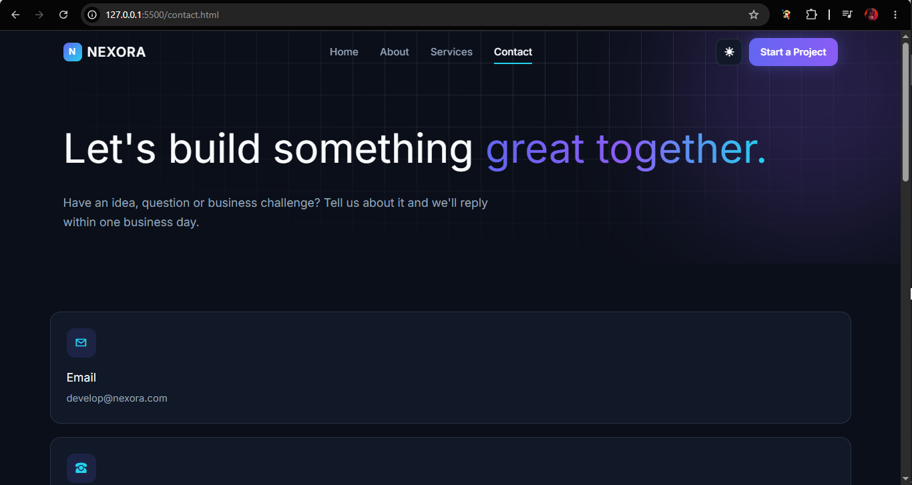
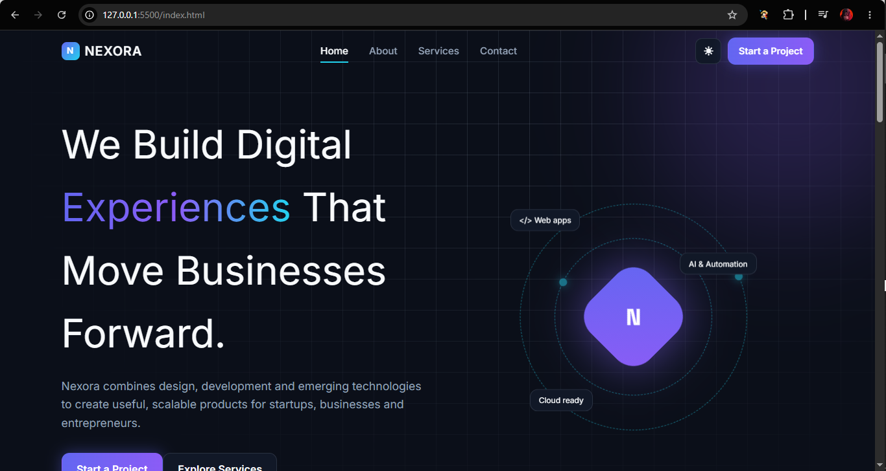
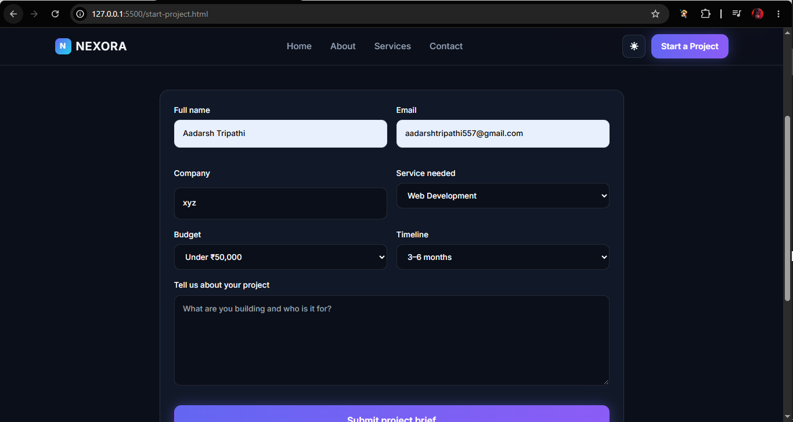
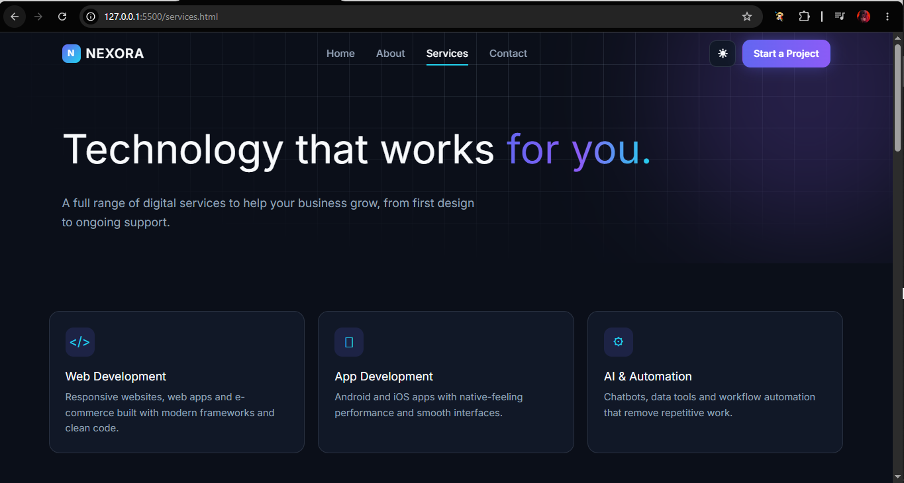
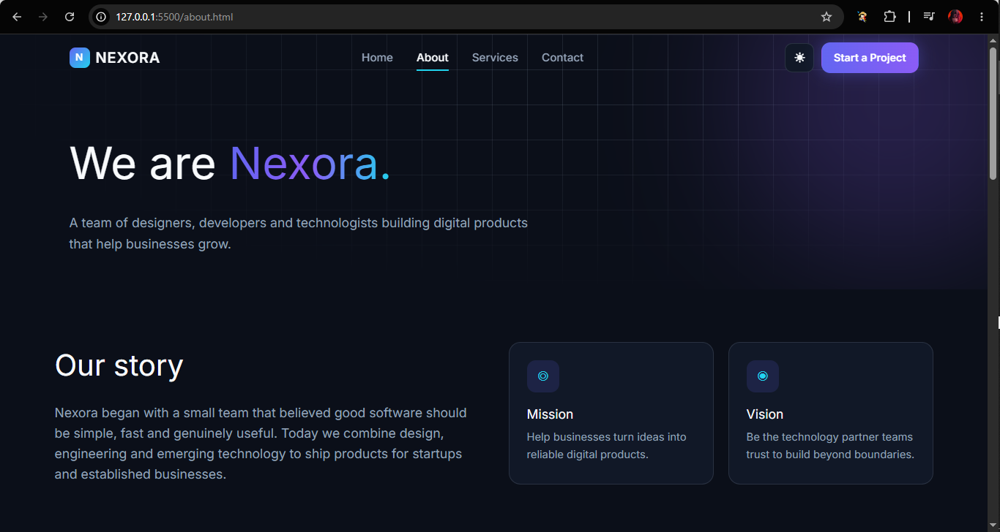
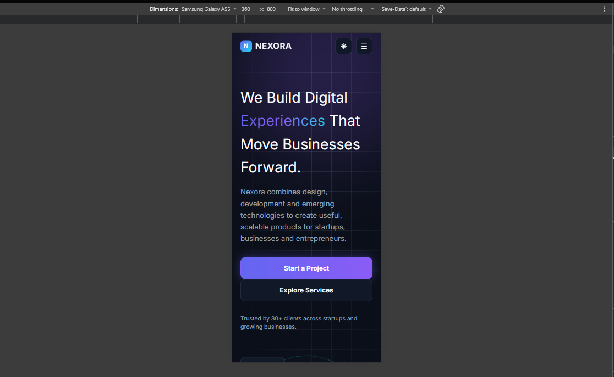
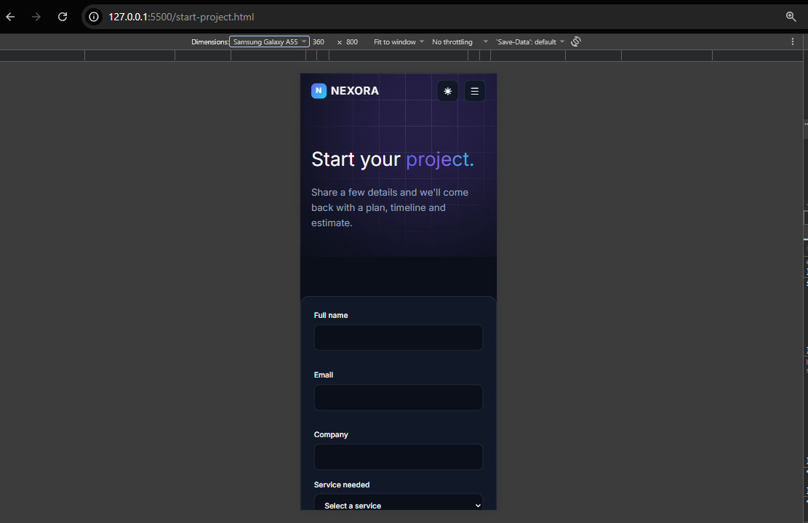
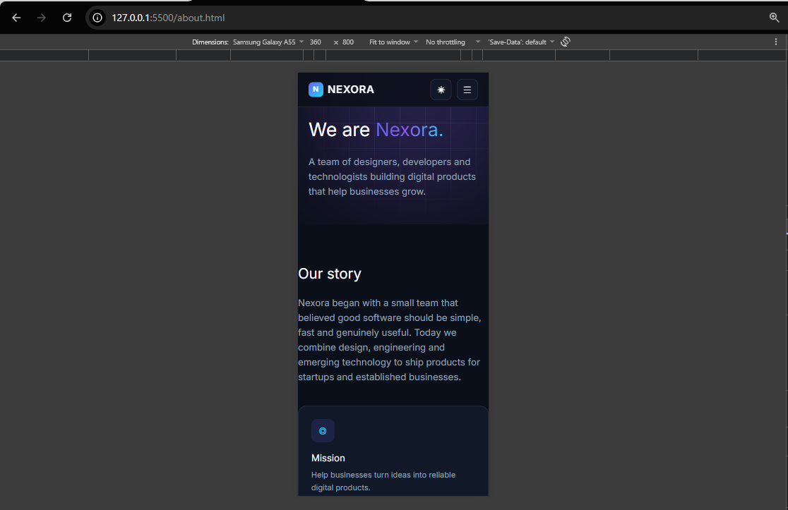

# 🚀 NEXORA — Build Beyond Boundaries

Welcome to **Nexora**, a modern website for a digital technology company.
It has a futuristic dark look, a glowing purple and cyan style, and a button to switch to a clean light theme whenever you like.

It is made with plain **HTML, CSS and JavaScript**, with just a tiny bit of **Tailwind CSS** for layout help.
No complicated tools. No install. Just open it and go.

---

## ✨ What's Inside

| Page | File | What it does |
|------|------|--------------|
| 🏠 Home | `index.html` | Introduces Nexora, shows stats, services, values and the work process |
| 👥 About | `about.html` | Tells our story, mission, values and meets the team |
| 🛠️ Services | `services.html` | Explains all six services, tools we use and common questions |
| ✉️ Contact | `contact.html` | Contact details and a message form |
| 💡 Start a Project | `start-project.html` | A form where visitors describe their idea |

---

## 🎨 Cool Features

- 🌗 **Theme button** – switch between dark and light. The site remembers your choice next time.
- 📱 **Works on every screen** – desktop, tablet and phone.
- 🍔 **Mobile menu** – a simple hamburger button on small screens.
- 🔢 **Moving numbers** – the stats count up when you scroll to them.
- 🌊 **Gentle animations** – cards rise, the hero graphic spins, and things fade in as you scroll.
- ✅ **Smart forms** – they warn you if a field is empty or the email looks wrong.
- 📌 **Smart navbar** – it changes style when you scroll and highlights the page you are on.

---

## 📁 Folder Map

```
company-website/
├── index.html          
├── about.html           
├── services.html       
├── contact.html        
├── start-project.html   
├── css/
│   └── style.css        
├── js/
│   └── script.js        
└── README.md           
```

---

## ▶️ How to Run

1. Download the whole `nexora` folder.
2. Double-click `index.html`.
3. That's it. Your browser opens the website. 🎉

> 💡 You need an internet connection the first time, because the fonts and Tailwind load from the web.

---

## 🧰 Built With

- **HTML5** – the page structure
- **CSS3** – colors, glow effects, light and dark themes
- **JavaScript** – menu, theme button, counters and form checks
- **Tailwind CSS** – a few layout helpers (grid and spacing)
- **Google Fonts** – Space Grotesk for headings, Inter for text

---

## ⚠️ Good to Know

- The forms check your answers and show a thank-you message, but they **do not send** the data anywhere yet. To receive messages, connect them to a backend or a form service.
- The team names, phone number and email are **samples**. Please replace them.
- The team section uses initials instead of photos. You can add real photos later.

---

---

## Screenshots

*Desktop-view

 

 

 

 

 

*Mobile-view

 

 

 

---
Made with ❤️ for **Nexora**. Leave a star if you like it.
